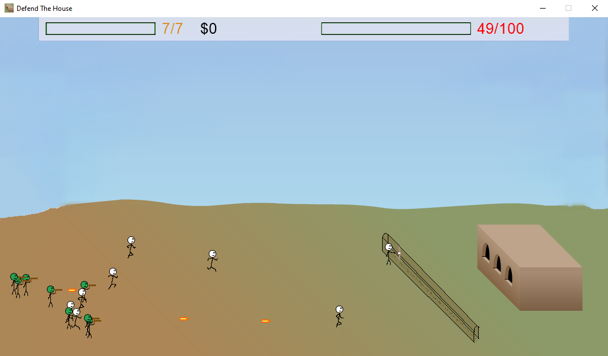

<<<<<<< HEAD
#Defend The House

##About

This game is a recreation of an old flash game, Storm the House.

The objective of this game is to survive 25 rounds. Each round, enemies will try to break down your house.

You can shoot at the enemies and buy things from the shop to help you survive.

Left click to shoot and press space to reload.

This project isn't licensed. All of the code is original.

Credit to Ivory Drive for the background image.

##Requirements

- Python 3.7 (later versions may not work)
- Pyglet 1.5.1

##Setup (Windows)

I made this project in 2020, and since the library I used isn't good at being compatible with previous versions of both python and itself, there are a few steps to get it running properly.

To get this one running properly, 

1. Install python 3.7. If you are on windows it can be installed here: https://www.python.org/downloads/release/python-379/. If your computer architecture is amd64, you can download the installer directly from here: https://www.python.org/ftp/python/3.7.9/python-3.7.9-amd64.exe

2. Run the installer, which should not interfere with other python versions on your computer. It'll just download python 3.7 as its own thing.

3. There is no need to add python 3.7 to your path; you can just use the absolute path which is likely at `C:\Users\{your_name}\AppData\Local\Programs\Python\Python37`. The executable should be called `python`.

4. Then run `C:\Users\{your_name}\AppData\Local\Programs\Python\Python37\scripts\pip install pyglet==1.5.1`. This installs a very old version of pyglet, which is what the game uses to render all its stuff.

5. Next, `cd` into where `main.py` for this game is and run `C:\Users\{your_name}\AppData\Local\Programs\Python\Python37\python main.py`.
=======
# Defend-the-House
A recreation of the old flash game Storm the House using the Pyglet library in Python.
>>>>>>> 76f79481d99b90027b95986db7f2df28e125dea2
